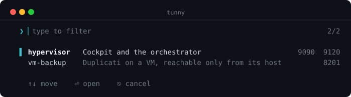

<div align="center">

# tunny

**Pick your admin SSH tunnel from a list instead of remembering its name.**

[](https://github.com/MorganKryze/tunny/actions/workflows/build.yml)
[](https://github.com/MorganKryze/tunny/actions/workflows/security.yml)
[](https://github.com/MorganKryze/tunny/actions/workflows/build.yml)
[](https://github.com/MorganKryze/tunny/actions/workflows/build.yml)
[](https://github.com/MorganKryze/tunny/releases)
[](LICENSE)

[](https://go.dev)
[](CONTRIBUTING.md#ground-rules)
[](https://github.com/MorganKryze/tunny/releases)



</div>

> A tunny swims a long way and finds the same water again. So does this.

You run three or four machines with no mesh agent on them, on purpose. The
hypervisor, the control plane, the gateway. Their web UIs sit on a loopback
address you reach with `ssh -N -L`, the command runs long enough that you wrote
it into a `justfile`, and by now you have forgotten which recipe was which.
Change network and the tunnel dies without a word.

tunny is that `justfile`, with the names on screen and a tunnel that comes back.

## Install

```sh
brew install MorganKryze/tap/tunny
```

That is the only packaged route for now. It works on macOS and on Linuxbrew,
and it brings the man page and the shell completions with it.

Otherwise, a binary from the [Releases](https://github.com/MorganKryze/tunny/releases)
page (darwin and linux, amd64 and arm64, with a `SHA256SUMS` and a build
attestation next to them), or from source:

```sh
go install github.com/MorganKryze/tunny/cmd/tunny@latest
```

AUR, nixpkgs and Debian are not done yet. [`packaging/`](packaging) holds a
working recipe for each, if you want to get there first.

## Requirements

An **OpenSSH client on your `PATH`**. tunny builds an argument list and runs
`ssh`; it implements no SSH of its own, which is why your `~/.ssh/config`,
your agent and your `known_hosts` keep working untouched. tunny checks for it
before printing anything and says so plainly if it is missing.

**macOS or Linux**, and FreeBSD, NetBSD and OpenBSD build and pass their tests
too. Not Windows: the terminal handling has no equivalent there.

**Go 1.25 or newer**, for `go install` only. A release binary needs nothing.

## Getting started

```sh
mkdir -p ~/.config/tunny
curl -o ~/.config/tunny/destinations.toml \
  https://raw.githubusercontent.com/MorganKryze/tunny/main/destinations.example.toml
$EDITOR ~/.config/tunny/destinations.toml
tunny
```

Type to filter: tunny narrows the list on the name and the description at once,
underlines what matched, and keeps a count on the right. Arrows move, Enter
opens, Escape gives up. The picture above is that list, drawn by the binary
itself from the example config below.

```sh
tunny              # the picker, most recent destination on top
tunny vm-backup    # straight to it, no picker
tunny --no-retry   # one attempt, no reconnection
tunny --preview    # what the list looks like, without opening anything
```

There is no `tunny add`, because the config is a file and a file belongs in an
editor. There is no `tunny list` either: the picker is the list. (`--list`
exists, printing one name per line, but it is there for the shell completions
rather than for you.)

Shell completions live in [`completions/`](completions), and complete
destination names by asking tunny rather than by parsing your config a second
time. A man page is in [`docs/tunny.1`](docs/tunny.1).

## What a session looks like

<!-- shot:banner --><!-- generated by `just shot`; edit destinations.example.toml, not this -->

```text
  ▌ hypervisor   Cockpit and the orchestrator

    Cockpit   http://localhost:9090
    Komodo    http://localhost:9120
```
<!-- /shot:banner -->

Then, as it runs:

```text
    ✓ tunnel open · Ctrl-C to close

    ⟳ connection lost, retrying 1/3 in 1s
    ✓ connection restored

    ✓ tunnel closed
```

`ssh -N` says nothing at all while it works, and nothing when it stops. Those
four lines are how you tell an open tunnel from a hung one, and a recovered one
from a closed one.

The banner goes to stdout, so `tunny gateway | grep http` gets you the URLs.
Everything after it, including the four status lines, goes to stderr.

## Configuration

`~/.config/tunny/destinations.toml`, honouring `XDG_CONFIG_HOME`. One
destination is one ssh invocation, with as many `forward` entries as there are
UIs behind it.

```toml
[[destination]]
name = "hypervisor"
desc = "Cockpit and the orchestrator"
host = "my-host"
forward = [
  { local = 9090, to = "127.0.0.1:9090", label = "Cockpit" },
  { local = 9120, to = "10.0.0.5:9120", label = "Komodo" },
]

[[destination]]
name = "vm-backup"
desc = "Duplicati on a VM, reachable only from its host"
host = "debian@10.0.0.5"
port = 22022
jump = "my-host"
forward = [{ local = 8201, to = "127.0.0.1:8200", label = "Duplicati" }]
```

| Key             | Required | What it does                                                                                                 |
| --------------- | -------- | ------------------------------------------------------------------------------------------------------------ |
| `name`          | yes      | what you type after `tunny`, and what the picker shows. Unique.                                               |
| `desc`          | no       | the picker's second column, and part of what the filter searches.                                            |
| `host`          | yes      | ssh's target. An alias from `~/.ssh/config` is the point: it already carries the user, the port and the key. |
| `port`          | no       | becomes `-p`, for what the alias does not cover.                                                             |
| `jump`          | no       | becomes `-J`, for a VM reachable only from its host.                                                         |
| `forward`       | yes      | at least one. Each entry becomes one `-L`.                                                                   |
| `forward.local` | yes      | the port on your machine, 1 to 65535.                                                                        |
| `forward.to`    | yes      | where it lands on the far side, written `host:port`.                                                         |
| `forward.label` | no       | the name printed next to the URL. Skip it and every forward on that destination shows the destination's own name, which two of them cannot tell apart. |

`host`, `port` and `jump` hand the work to `~/.ssh/config` instead of copying
it. tunny builds an argument list and runs the real ssh binary, so your aliases,
`ProxyJump`, the agent, `known_hosts` and the host-key prompt keep working the
way you set them up.

tunny validates the file before it does anything: unique names, at least one
forward, ports in range, a `host:port` on the far side. A key it does not know
is an error too, since `forwards` instead of `forward` would otherwise leave
you a destination with no tunnel and no complaint.

Recency lives in `~/.local/state/tunny/recent`, honouring `XDG_STATE_HOME`. One
name per line, most recent first. The order is the data, so a file you can read
with `cat` you can repair with `vim`. Names that left the config get dropped
when tunny reads it, which is the whole cleanup mechanism.

## Reconnection

Three attempts per outage, waiting 1s, 2s and 4s.

Hold a tunnel for thirty seconds and the counter resets. It counts per outage
rather than per session, so a tunnel you leave open all day survives five
network changes while a destination that is genuinely down gives up in three
quick tries. `ssh -N` stays quiet when things go well, so how long the process
lived is the least fragile success signal available.

**Ctrl-C never relaunches.** tunny catches the interrupt itself rather than
reading ssh's exit code, because a tunnel you cannot kill is the worst thing
this program could do to you.

Two failures skip the retries and hand you ssh's own words, since both would
fail the same way three times over: `Permission denied` and
`Could not resolve hostname`. Host down, network gone, wifi switched, laptop
woken from sleep: all worth another try.

A third one never reaches ssh. tunny binds the local port first, the same
syscall `ssh -L` is about to make, so the picker marks a destination you cannot
open before you choose it:

```text
    control-plane   Duplicati on the control plane                  ● 8201 in use
```

Choose it anyway and you get the port and a way to find what holds it, instead
of three lines of ssh diagnostics arriving after a banner that promised a
tunnel:

```text
    ✗ control-plane: local port 8201 is already taken
      lsof -nP -iTCP:8201 -sTCP:LISTEN   shows what has it
```

`Address already in use` stays on the hopeless list as a backstop, since a port
can be taken in the moment between the check and the launch.

tunny always passes `-o ExitOnForwardFailure=yes`. Without it, ssh stays
connected with a dead forward and you find out from a browser tab minutes
later.

## Details you may care about

Colour follows [NO_COLOR](https://no-color.org) and never reaches a pipe.
`CLICOLOR_FORCE` brings it back through a pipe, and `NO_COLOR` still wins over
that: between two people asking for opposite things, the one asking for less
gets their way. The layout gives way in a fixed order as your
terminal narrows: port labels first, then the ports, then the descriptions, so
no line ever wraps. Closing a tunnel leaves no `^C` on screen, because tunny
clears the terminal flag that echoes it and puts it back on the way out.

`tunny --preview` prints the list without opening anything, and takes a width so
you can check the layout at a size you do not own: `tunny --preview 60`.

## Files, environment and exit codes

| Path | What |
| --- | --- |
| `~/.config/tunny/destinations.toml` | your destinations. `XDG_CONFIG_HOME` moves it. |
| `~/.local/state/tunny/recent` | the recency order, one name per line, mode 0600. `XDG_STATE_HOME` moves it. |

tunny writes nothing else, anywhere. It listens on nothing and opens no
connection of its own: the only network traffic is `ssh`'s.

| Variable | Effect |
| --- | --- |
| `NO_COLOR` | any value, even empty, switches colour off |
| `CLICOLOR_FORCE` | anything but `0` keeps colour through a pipe. `NO_COLOR` still wins. |
| `TERM=dumb` | switches colour off |
| `XDG_CONFIG_HOME`, `XDG_STATE_HOME` | move the two paths above |

| Exit | When |
| --- | --- |
| `0` | the tunnel was closed on purpose, **and** when you press Escape in the picker, **and** for `--version` and `--preview` |
| `1` | anything that failed: no config, unknown destination, port taken, ssh gave up |
| `2` | an unrecognised flag, from Go's flag package |

Escape and success sharing `0` is worth knowing before you script around it:
`tunny <name>` is the form to script with, since it never opens the picker.

## Uninstall

```sh
rm -f "$(command -v tunny)"          # or: brew uninstall tunny
rm -rf ~/.config/tunny ~/.local/state/tunny
```

## Troubleshooting

**`ssh is not on your PATH`.** Install an OpenSSH client. tunny stops before it
does anything else, so nothing is left half-done.

**`local port 8201 is already taken`.** Something is listening where a forward
wants to bind, often a tunnel left open in another window. The message carries
the `lsof` line that names it, and the picker marks these before you choose.

**`Permission denied` or `Could not resolve hostname`.** Those are ssh's own
words. tunny stops on them instead of retrying, since all three attempts would
fail the same way. Run it by hand with `-v` to see more:
`ssh -v -N -L <local>:<to> <host>`.

**`not a terminal`.** You piped tunny somewhere, or ran it from a script. Give
it a destination name: `tunny gateway`.

**`terminal too narrow`.** The picker needs 20 columns. Widen the window and it
draws again on the next keystroke.

**No config after upgrading from tuna.** tunny was called tuna until v0.2.0,
and the error carries the `mv` command that moves your config across.

## What tunny does not do

| Not here                                        | When to reconsider                                                                                                                                                     |
| ----------------------------------------------- | ---------------------------------------------------------------------------------------------------------------------------------------------------------------------- |
| A generic `tunny ip port`                        | Never, absent proof otherwise. That is `ssh -N -L 8200:10.0.0.5:8200 my-host` typed by hand, and an ad-hoc form would cost an argument parser to save twenty characters. |
| Opening the browser                             | The day it genuinely grates. tunny prints the URL and your terminal makes it clickable, and the choice turns ambiguous the moment a destination has two forwards.        |
| Several tunnels at once, a daemon, `stop`, logs | When several terminal tabs become a nuisance. The cost sits after the launching: PIDs, a state file, orphans after a crash, and logs to store and to read.              |
| Mesh URLs, interactive ssh                      | Neither needs help. Mesh URLs already open in a browser, and `ssh hypervisor` types fine on its own.                                                                    |

## Contributing

[CONTRIBUTING.md](CONTRIBUTING.md) has the dev loop and the ground rules,
[PACKAGING.md](PACKAGING.md) has everything a distribution maintainer needs,
and [CHANGELOG.md](CHANGELOG.md) has what changed and when.

## License

[GPL-3.0-only](LICENSE), and only: this project grants no "or any later
version" permission.

Copyright (C) 2026 Morgan Kryze <contact@libresoftware.cloud>
